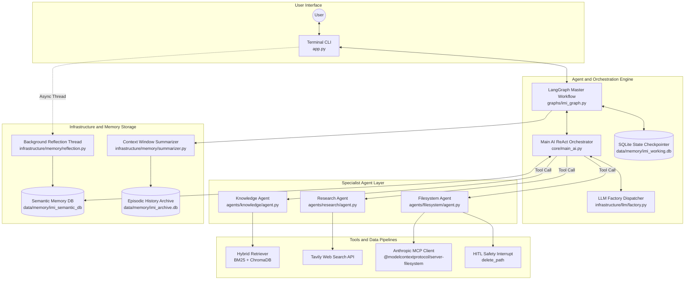
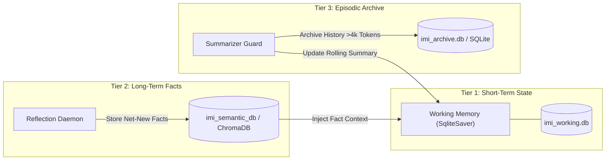

# Imi AI — Multi-Agent Operating System

[](https://www.python.org/)
[](https://www.langchain.com/)
[](https://modelcontextprotocol.io/)

Imi AI is an expandable, multi-agent AI assistant built on **LangGraph**, **LangChain**, **Pydantic**, and the **Model Context Protocol (MCP)**. It acts as a central intelligence hub that automatically analyzes user queries and routes them to a plug-and-play ecosystem of specialized autonomous agents.

---

## System Architecture



---

## Overview & Key Concepts

The core architecture follows modular decoupling:
- **Dynamic Agent Registration**: Creating a subclass of `BaseAgent` inside `agents/` auto-registers the agent at boot time. Zero hardcoding required.
- **ReAct Orchestrator**: The main node (`main_ai_node`) dynamically binds registered agents as tools (`call_<agent>_agent`), evaluates state, and executes tool loops.
- **Multi-Strategy RAG Engine**: Switch between Basic Hybrid (BM25 + Vector), Corrective RAG (CRAG), and Self-Reflective RAG (Self-RAG) via `.env`.
- **Anthropic MCP Integration**: Interoperable local filesystem tools via `@modelcontextprotocol/server-filesystem` over stdio with Human-in-the-Loop (HITL) safety (`interrupt`).

---

## Memory Architecture

Imi AI uses a three-tier memory hierarchy to manage context token limits, short-term threads, and long-term user recall:



1. **Working Memory (`imi_working.db`)**: LangGraph `SqliteSaver` checkpointer for thread-level state management.
2. **Semantic Memory (`imi_semantic_db`)**: ChromaDB vector store containing factual user information, updated asynchronously by a background daemon thread after each response.
3. **Episodic Archive (`imi_archive.db`)**: SQLite database containing historic log entries. Triggered when context exceeds 4,000 tokens to prune and summarize conversation history.

---

## Specialist Agents

### 1. Knowledge Agent (`agents/knowledge/`)
RAG agent operating on local documents in `data/documents/`. Strategy is configured via `RAG_STRATEGY` in `.env`:
- **`basic`**: BM25 (40% weight) + ChromaDB (60% weight) via `EnsembleRetriever`.
- **`crag`**: Evaluates chunk relevance scores. Triggers Tavily web search if scores fall below threshold, then filters sentence-by-sentence via NLTK.
- **`self_rag`**: Evaluates retrieval necessity, document relevance, hallucination grounding (`issup`), and answer usefulness (`isuse`) in an iterative loop.

### 2. Research Agent (`agents/research/`)
Deep web research agent:
- **Planning**: Generates 2–3 targeted search queries using structured Pydantic outputs (`SearchPlan`).
- **Execution**: Fetches search results via Tavily API.
- **Synthesis**: Compiles structured markdown reports with source citations.

### 3. Filesystem Agent (`agents/filesystem/`)
Connects to `@modelcontextprotocol/server-filesystem` over stdio:
- Exposes tools for reading, writing, editing, inspecting, and searching local directories.
- Destructive operations (such as `delete_path`) call `langgraph.types.interrupt()`, requiring human terminal confirmation (`y/n`) before execution resumes.

---

## Directory Structure

```text
Imi-AI/
├── app.py                # Main CLI entry point
├── test_filesystem_mcp.py# Standalone diagnostic test script for MCP Filesystem server
├── requirements.txt      # Project dependencies
├── .env.example          # Environment variable template
│
├── core/
│   ├── config.py         # Pydantic Settings singleton
│   ├── state.py          # Master ImiState TypedDict
│   ├── registry.py       # Auto-discovery agent registry
│   ├── main_ai.py        # ReAct Orchestrator node & tool binding
│   └── router.py         # Conditional routing logic
│
├── agents/
│   ├── base.py           # Abstract BaseAgent class
│   ├── knowledge/        # Document RAG agent
│   ├── research/         # Web research agent
│   └── filesystem/       # MCP Filesystem agent
│
├── infrastructure/
│   ├── llm/
│   │   └── factory.py    # LLM provider factory (Groq, HuggingFace, OpenAI)
│   ├── retrieval/
│   │   ├── vector_store.py# BM25 + ChromaDB Hybrid Retriever
│   │   ├── crag.py       # Corrective RAG implementation
│   │   └── self_rag.py   # Self-Reflective RAG pipeline
│   └── memory/
│       ├── manager.py    # MemoryManager interface
│       ├── reflection.py # Background factual reflection daemon
│       └── summarizer.py # Context window token manager
│
├── data/
│   ├── documents/        # PDF and TXT source documents
│   ├── memory/           # Persistent databases (SQLite & ChromaDB)
│   └── ingest.py         # Document chunking, MD5 hashing, & embedding script
│
└── tools/
    ├── filesystem.py     # Native Python filesystem tools with HITL interrupt safety
    └── memory_tools.py   # Memory store/search tool interfaces
```

---

## Quick Start

### 1. Prerequisites
- Python 3.10+
- Node.js 18+ and `npx`

### 2. Setup Environment
```bash
git clone https://github.com/your-username/Imi-AI.git
cd Imi-AI

python3 -m venv .venv
source .venv/bin/activate

pip install -r requirements.txt
```

### 3. Environment Setup
Copy `.env.example` to `.env` and fill in credentials:
```bash
cp .env.example .env
```

Example `.env` configuration:
```ini
GROQ_API_KEY=gsk_...
TAVILY_API_KEY=tvly-...
COHERE_API_KEY=...
RAG_STRATEGY=self_rag
MCP_FILESYSTEM_ALLOWED_DIRS="/media/imranbuttcodes/Data/Nexus"
```

### 4. Index Documents
Place PDF or TXT files in `data/documents/` and run the ingestion service:
```bash
python data/ingest.py
```

### 5. Start CLI
```bash
python app.py
```

### 6. Run MCP Server Diagnostic
To test local MCP stdio server integration independently:
```bash
python test_filesystem_mcp.py
```

---

## Roadmap

- [ ] **Code Execution Agent**: Containerized code execution environment (Docker/Modal).
- [ ] **Multi-Server MCP Adapters**: Integration with GitHub, PostgreSQL, and Slack MCP servers.
- [ ] **REST API Server**: FastAPI service with Server-Sent Events (SSE) streaming for web clients.
- [ ] **Multi-modal RAG**: PDF parsing with layout analysis and image/table extraction.
